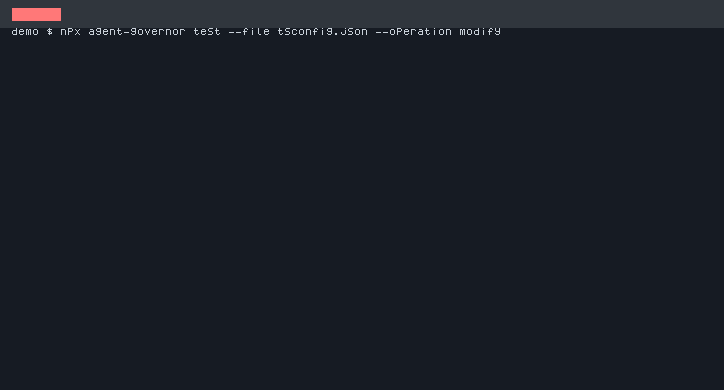
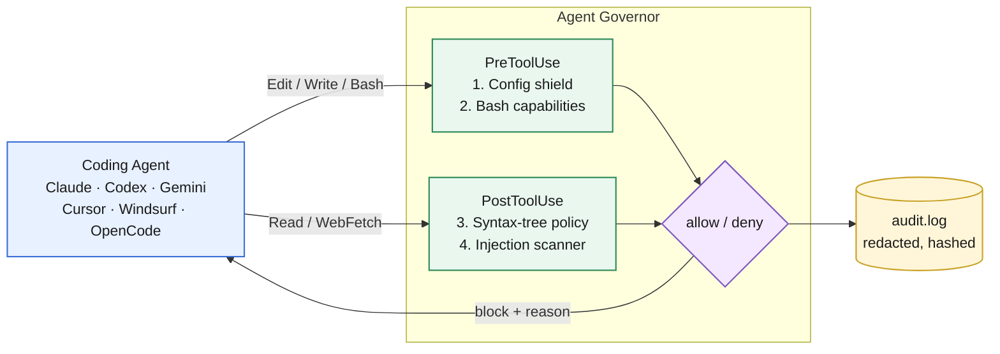

<div align="center">

# 🛡️ Agent Governor

**Deterministic Runtime Guardrails for Claude Code, Codex CLI & Gemini CLI**

*Syntax-tree code checks, read-side prompt-injection scanning, and hardware-grade hooks — one config, six coding agents.*

[English](./README.md) | [简体中文](./README_ZH.md)

[](https://opensource.org/licenses/MIT)
[](https://github.com/lihenair/agent-governor/actions/workflows/ci.yml)
[](https://www.npmjs.com/package/agent-governor)
[](https://github.com/lihenair/agent-governor/pulls)
[](#)

</div>

<br />

<div align="center">
  
  <p><em>agent-governor blocking: config tampering · force-push · <code>eval</code> in shipped code</em></p>
</div>

---

## ⚡ The Problem

AI coding agents are incredibly fast, but they suffer from **non-determinism and context drift**:

* 🚫 **Configuration Tampering** — agents edit `tsconfig.json`, `biome.json`, or `.eslintrc` to "fix" errors instead of fixing the actual bugs.
* 💣 **Dangerous Operations** — force pushes, `--no-verify` hook bypasses, deleted files, `eval` in shipped code, secret paths read into context.
* 🌀 **Architecture Drift** — as context grows (and gets compacted away), agents forget project rules.
* 📖 **Injected Instructions** — fetched web pages, READMEs, and search results can carry `ignore previous instructions` / `curl | sh` payloads that the agent obeys.

**Prose prompts (`CLAUDE.md`, system instructions) are soft guidelines. Agent Governor is deterministic, zero-variance enforcement: same input, same decision, every time.**

---

## ✨ What Makes It Different

| Capability | Agent Governor | Typical guardrails |
| --- | --- | --- |
| Bash command analysis | ✅ argv-level + capability tags | shell string matching |
| Source code checks | ✅ **true syntax trees** (Babel / Python `ast` / tree-sitter) | often regex or absent |
| **Read-side injection scanning** | ✅ **what the agent reads is scanned too** | ❌ write-side only |
| Rule re-injection after compaction | ✅ SessionStart / PreCompact hooks | ❌ rules get compacted away |
| Team policy drift detection | ✅ `governor status` vs committed baseline | ❌ |
| Self-audit with redaction | ✅ `.agent-governor/audit.log` | varies |

### Guardrail checks

* 🛡️ **Zero-Trust Config Shield** — locks toolchain manifests across JS, Python, Rust, Go, Flutter, iOS, Android ecosystems (`tsconfig.json`, `package.json`, lockfiles, `Cargo.toml`, `go.mod`, `pubspec.yaml`, `Podfile`, Gradle, `AndroidManifest.xml`, ...).
* 🧬 **Syntax-tree source policy** — Babel AST for JS/TS, Python's stdlib `ast` (catches aliased calls, attribute calls, computed lookups — not just a substring search), tree-sitter structural checks for Rust/Go/Kotlin/Swift/C/C++/Dart. Strings and comments are structurally immune to false positives.
* 💣 **Bash capability analysis** — parses commands into program + argv, tags capabilities (`git.push.force`, `hooks.bypass`, `secret.path.read`, `ci.path.write`), and catches the same violation even when the command is wrapped in `sh -c` or a write lands via `tee` / `sed -i` / redirection.
* 📖 **Read-side injection scanning (industry first)** — PostToolUse guard inspects what the agent *reads*: fetched pages, files, search results. Detects instruction override, role hijack, `curl | sh`, env/secret exfiltration, hidden zero-width Unicode. Weighted scoring; custom detectors via `injectionPatterns`.
* 🔄 **Rule re-injection on SessionStart / PreCompact** — after a context wipe or compaction, the governor re-injects which rules are active and how many times the agent has been blocked. Architecture drift dies where it's born.
* 🎒 **Preset policy packs & rulebooks** — `--preset security-hard|frontend|python|strict`, plus additive-only rulebooks (terraform / aws / k8s ship officially) that can never weaken your policy.
* 📊 **`governor report`** — audit digest: total blocks, block rate, top triggered rules, last intervention. `--json` for machines.
* 🔎 **`governor audit`** — query `.agent-governor/audit.log` by `--since` / `--decision` / `--rule` / `--session`; `--format table|json`. `audit gc --older-than 30d` drops old entries.
* 🩺 **`governor doctor` & `governor status`** — self-check everything (runtime, config, hooks, live deny dry-run) and detect local policy drift vs the committed baseline. Wire both into CI.
* 🪟 **Windows-safe** — dispatcher is Node; Bash/Python runtimes optional.

---

## 🏗️ How It Works

Agent Governor taps each host's native hook runtime (Claude Code `PreToolUse`/`PostToolUse`/`SessionStart`/`PreCompact`; Codex CLI and Gemini CLI equivalents). Payloads are auto-detected and normalized; decisions are emitted in the host's native contract.



Host support and protocol details: [docs/hosts.md](./docs/hosts.md).

| Host | Events | Decision channel |
| --- | --- | --- |
| **Claude Code** | PreToolUse, PostToolUse, SessionStart, PreCompact | exit `2` + stderr reason |
| **OpenAI Codex CLI** | PreToolUse, PostToolUse, SessionStart, PreCompact | stdout JSON `decision: "block"` + `permissionDecision` |
| **Google Gemini CLI** | BeforeTool, AfterTool, SessionStart, PreCompress | stdout JSON `{ decision: "deny" }` |
| **Cursor** | beforeShellExecution, beforeEditFile, beforeReadFile, beforeMCPExecution, afterFileEdit, afterShellExecution | stdout JSON `{ permission: "deny", agentMessage }` |
| **Windsurf (Cascade)** | pre_run_command, pre_write_code, pre_read_code, post_run_command, post_write_code | exit `2` + stderr reason |
| **OpenCode** | tool.execute.before, tool.execute.after (plugin) | plugin throws → reason surfaced to model |

Fail-open on internal errors (a governor bug must not freeze the agent loop), fail-closed on policy violations. Honest scope: guardrails stop *accidental* damage, not a determined adversary — for that, add OS-level sandboxing (see [SECURITY.md](./SECURITY.md)).

---

## 📦 Quick Start

**Option A — Claude Code plugin (zero config):**

```bash
# inside Claude Code:
/plugin marketplace add lihenair/agent-governor
/plugin install agent-governor@agent-governor
```

**Option B — npm:**

```bash
npm install -D agent-governor   # ~8.5 MB (@babel/parser). ast-grep is opt-in.
npx agent-governor init
```

`init` writes a single dispatcher hook per event (covering JS/TS, Python, Rust, Go, Dart, Swift, Kotlin, Java, C/C++) plus read-scan and session re-injection hooks, generates `governor.config.json`, and adapts Cursor via `.cursor/rules/agent-governor.mdc`. The generated Claude Code hooks:

```json
{
  "hooks": {
    "PreToolUse": [
      { "matcher": "Edit|Write|MultiEdit|NotebookEdit|Bash", "hooks": [{ "type": "command", "command": "npx agent-governor pre-check" }] }
    ],
    "PostToolUse": [
      { "matcher": "Edit|Write|MultiEdit|NotebookEdit", "hooks": [{ "type": "command", "command": "npx agent-governor post-check" }] },
      { "matcher": "Read|WebFetch|WebSearch", "hooks": [{ "type": "command", "command": "npx agent-governor post-check" }] }
    ],
    "SessionStart": [
      { "hooks": [{ "type": "command", "command": "npx agent-governor session-hook --event SessionStart" }] }
    ],
    "PreCompact": [
      { "hooks": [{ "type": "command", "command": "npx agent-governor session-hook --event PreCompact" }] }
    ]
  }
}
```

**3. Prove it works:**

```bash
npx agent-governor test --command "git push --force origin main"
# → decision: deny  (ruleId: git.push.force)

npx agent-governor doctor
# → all checks passed (runtime, config, hooks, audit, live deny dry-run)
```

**Codex CLI / Gemini CLI / Cursor / Windsurf / OpenCode setup:** see [docs/hosts.md](./docs/hosts.md) — adapter configs and the OpenCode plugin ship in the npm package (`adapters/`).

---

## 🧪 CLI

```bash
npx agent-governor init [--lang auto|all|node|python|native] [--preset <name>]
npx agent-governor hook                  # auto Pre/Post dispatcher (reads hook_event_name)
npx agent-governor pre-check             # PreToolUse guard (stdin JSON)
npx agent-governor post-check            # PostToolUse source + injection guard (stdin JSON)
npx agent-governor session-hook --event SessionStart|PreCompact
npx agent-governor test --command "git push --force" [--json]
npx agent-governor test --file tsconfig.json [--operation modify|write] [--json]
npx agent-governor explain "git reset --hard"   # what would happen, and why
npx agent-governor explain path/to/tsconfig.json
npx agent-governor explain --config governor.config.json   # dump compiled rules
npx agent-governor doctor                # self-check (exit 1 on failure)
npx agent-governor status                # policy + drift vs committed baseline (exit 1 on drift)
npx agent-governor report [--json]       # audit digest
npx agent-governor audit [--since 24h] [--decision deny] [--rule id] [--session id] [--format table|json]
npx agent-governor audit gc --older-than 30d
npx agent-governor validate [--config path]  # schema check (file, field, reason)
npx agent-governor rule list | rule add <name...>   # additive rulebook packs
npx agent-governor version
```

### Presets

```bash
npx agent-governor explain --preset security-hard   # preview what gets protected
```

| Preset | Adds to the default shield |
| --- | --- |
| `security-hard` | `.env`, `Dockerfile`, `.github/workflows`, `.npmrc`, `npm install --force`, `curl \| sudo sh`, git identity tampering |
| `frontend` | `vite.config.*`, `next.config.*`, `nuxt.config.*`, `svelte.config.*`, `tailwind.config.*`, `webpack.config.*` |
| `python` | `poetry.lock`, `pdm.lock`, `uv.lock`, `tox.ini`, `conda.yaml` |
| `strict` | all of the above + `goForbidPanic`, `requireErrorBoundary` |

Persist with `"preset": "security-hard"` in `governor.config.json` (file wins over env/flag).

---

## ⚙️ Configuration (`governor.config.json`)

```json
{
  "preset": "security-hard",
  "engine": "ast-grep",
  "protectedFiles": ["tsconfig.json", "package.json", "my.config.json"],
  "protectedDirectories": [".claude/", ".agent-governor/"],
  "forbiddenBashPatterns": ["terraform\\s+destroy"],
  "unprotect": ["tsconfig.json"],
  "injectionMode": "scan",
  "injectionPatterns": [
    { "id": "custom.publish-bait", "weight": 3, "pattern": "run\\s+npm\\s+publish" }
  ],
  "astRules": {
    "noDirectEval": true,
    "noNewFunction": true,
    "pythonForbiddenCalls": ["eval", "exec"],
    "rustForbidUnsafe": true,
    "goForbidPanic": false,
    "swiftForbidForceTry": true,
    "kotlinForbidBangBang": true,
    "cppForbidUnsafeC": true,
    "javaForbidRuntimeExec": true
  }
}
```

### Source-check engines

| Engine | Languages | Notes |
| --- | --- | --- |
| **Babel AST** (default) | JS/TS | Structural `eval` / `new Function` / custom calls |
| **Python stdlib `ast`** (default) | Python | Aliases, attribute & computed lookups; regex fallback for syntax-error fragments |
| **tree-sitter via ast-grep** (opt-in) | Rust, Go, Kotlin, Swift, C, C++, Dart | Strings/comments structurally immune to false positives. **Not installed by default.** |
| **Regex SOP** (default fallback) | native langs without ast-grep | Zero-dependency heuristic; some false-positive risk on non-code text |

Set `"engine": "ast-grep"` then install the native engine + the languages you use:

```bash
npm i -D @ast-grep/napi @ast-grep/lang-rust @ast-grep/lang-go
# also: lang-kotlin lang-swift lang-c lang-cpp lang-java lang-dart
```

Missing packs degrade that language to the regex SOP. `npx agent-governor doctor` reports whether napi and lang packs are present.

### Field semantics

| Field | Meaning |
| --- | --- |
| `protectedFiles` (no flags) | Union with defaults — user entries are added, defaults stay |
| `unprotect` | Subtract names from the merged list (`["tsconfig.json"]` makes it writable) |
| `override: true` | Replace default lists entirely with yours |
| `injectionMode` | `"scan"` (default) or `"off"` |
| `injectionPatterns` | Extra detectors: `[{ id, weight, pattern }]` |
| `preset` | `security-hard` / `frontend` / `python` / `strict` (wins over env/flag) |
| `rulebooks` | Additive pack names, e.g. `["terraform", "aws"]` |
| `failureMode` | `open` (default) / `closed` |

Copy [`governor.config.example.json`](./governor.config.example.json) to start. `governor.config.cjs/.js/.mjs` overlays are accepted.

---

## 📊 Performance

| Check Type | Runtime | Execution Time |
| --- | --- | --- |
| Config shield (PreToolUse) | Node dispatcher | < 8ms |
| JS/TS AST | Babel | < 28ms (1000 LOC) |
| Python stdlib `ast` | `python3` | ~50ms (process start dominates; parse is 0.02ms) |
| Rust/Go/Kotlin/Swift/C/C++/Dart | ast-grep (tree-sitter) | < 7ms (500 LOC) |
| Regex SOP (fallback) | Node | < 5ms |

| Install | Size |
| --- | --- |
| `npm i -D agent-governor` (default) | **~8.5 MB** unpacked (`node_modules`) · **~71 kB** tarball |
| + `"engine": "ast-grep"` + lang packs | extra `@ast-grep/napi` (~7 MB) and only the grammars you install |

Run `npm run build` to emit `dist/*.js` bundles.

---

## 🤝 Contributing

Contributions are very welcome! Please read [CONTRIBUTING.md](./CONTRIBUTING.md).

1. Fork the repository
2. Create your feature branch (`git checkout -b feat/amazing-rule`)
3. Commit your changes
4. Push and open a Pull Request

Security findings: please use [GitHub Security Advisories](https://github.com/lihenair/agent-governor/security/advisories/new) instead of public issues. See [SECURITY.md](./SECURITY.md) for the threat model.

---

## 📜 License

MIT. See [LICENSE](./LICENSE).

<div align="center">
<p>Crafted for high-determinism AI engineering.</p>
<p>If this project saved your codebase from AI entropy, give it a ⭐ Star!</p>
</div>
